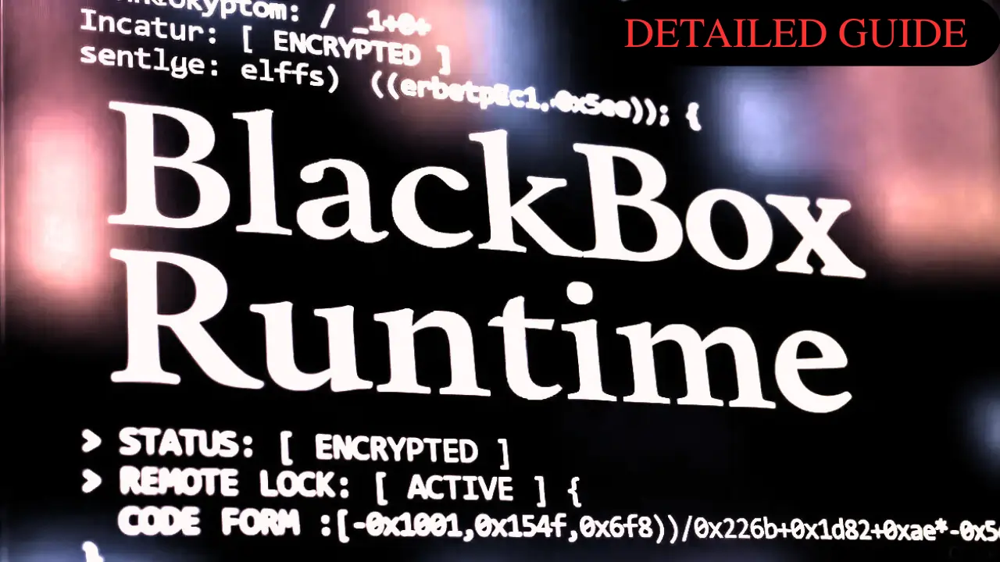

<!-- Hero Section -->
<div align="center">



<h1>🛡️ 𝐁𝐥𝐚𝐜𝐤𝐁𝐨𝐱 𝐑𝐮𝐧𝐭𝐢𝐦𝐞</h1>
<p><i>Complete Architecture & Implementation Guide</i></p>

</div>

---

## 📖 Table of Contents

1. [System Overview](#-system-overview)
2. [Two-Project Architecture](#-two-project-architecture)
3. [How It Works](#-how-it-works)
4. [Configuration Reference](#-configuration-reference)
5. [Security Model](#-security-model)
6. [Advanced Features](#-advanced-features)
7. [Best Practices](#-best-practices)
8. [Troubleshooting](#-troubleshooting)

---

## 🎯 System Overview

### The Problem

When distributing React components to clients, you face:
1. **Code Theft**: JavaScript is readable; anyone can copy components
2. **License Violation**: Users continue using features after trials end
3. **Unauthorized Distribution**: Clients share code without permission

### The Solution

BlackBox Runtime provides **dual-layer protection**:

**Layer 1: Code Obfuscation**
- Transforms JavaScript into unreadable, encrypted code
- Makes reverse engineering practically impossible
- Protects intellectual property

**Layer 2: Remote License Control**
- Components check backend server for access permission
- Enable/disable features without touching client code
- Real-time control from anywhere

### Key Benefits

✅ **Remote Control**: Toggle access via environment variables  
✅ **Irreversible**: Obfuscated code cannot be de-obfuscated  
✅ **Professional**: Graceful UI when access is denied  
✅ **Scalable**: Handle multiple components and pages  
✅ **Secure**: Multiple validation layers prevent tampering

---

## 🏗️ Two-Project Architecture

BlackBox uses a **Creator/Consumer** model to keep your licensing system secure.

### Architecture Overview

```
┏━━━━━━━━━━━━━━━━━━━━━━━━━━━━━━━┓        ┏━━━━━━━━━━━━━━━━━━━━━━━━━━━━━━━━━━┓
┃  🔒  PROJECT 1 (Creator)      ┃──────▶ ┃  📦  PROJECT 2 (Consumer)        ┃
┃  "MyProject"                  ┃        ┃  "MyProject_deliver"             ┃
┃  KEEP PRIVATE                 ┃        ┃  SHIP TO CLIENTS                 ┃
┗━━━━━━━━━━━━━━━━━━━━━━━━━━━━━━━┛        ┗━━━━━━━━━━━━━━━━━━━━━━━━━━━━━━━━━━┛

📂 Contains:                             📂 Contains:
───────────                              ───────────
• src/LICENSE_O_S/                       • src/Core/ (obfuscated)
  ├── config.variables.ts                • src/BarrelFile/
  ├── LicenseGuard/                        └── ComponentsToBeLocked.tsx
  │   ├── useComponent_G.ts              • Normal app files (pages, routes)
  │   └── ui_G.tsx                       • package.json, vite.config.ts
• vite.lock.config.ts
• obfuscate.js                           🚫 Does NOT Contain:
• VercelBackend/                         ────────────────
  ├── api/guard.js                       ❌ LICENSE_O_S/ (entire folder)
  ├── package.json                       ❌ vite.lock.config.ts
  └── vercel.json                        ❌ obfuscate.js
• src/Components/ (source)               ❌ VercelBackend/
• src/BarrelFile/                        ❌ Original source components
  └── ComponentsToBeLocked.tsx

🎯 Purpose:                              🎯 Purpose:
───────────                              ───────────
Development & build environment          Clean client delivery
Build obfuscated components              No licensing system visible
Manage backend deployment                Production-ready code only
```

### Why Two Projects?

**Security**: Client never sees your licensing infrastructure, build configs, or obfuscation tools

**Maintenance**: Update components in Project 1, regenerate obfuscated bundle, copy to Project 2

**Clean Delivery**: Client receives only production-ready code with zero traces of protection system

### Workflow

```
1. Develop in Project 1
   ├── Edit source components
   ├── Wrap with guards
   └── Test functionality

2. Build locked version
   └── npm run build:lock
       ├── Vite bundles components
       └── Obfuscates output
           └── Creates src/Core/core-ui-runtime.es.js

3. Update Project 2
   ├── Copy Core/ to Project 2
   └── Update imports in ComponentsToBeLocked.tsx

4. Ship Project 2
   └── Client receives clean, secure code
```

---

## ⚙️ How It Works

### Phase 1: Build Time (Project 1)

#### Step 1: Component Preparation

Wrap each component you want to lock:

```typescript
// src/Components/QuickLinkButton.tsx
import { G_Wrapper } from "../LICENSE_O_S/LicenseGuard/ui_G.tsx";
import { useComponentGuard } from "../LICENSE_O_S/LicenseGuard/useComponent_G.ts";

export const QuickLinkButton: React.FC = () => {
  const GS = useComponentGuard();

  return (
    <G_Wrapper State_G={GS}>
      <button>Click me</button>
    </G_Wrapper>
  );
};
```

#### Step 2: Barrel File Configuration

List all components to lock in one file:

```typescript
// src/BarrelFile/ComponentsToBeLocked.tsx
import { QuickLinkButton } from "../Components/QuickLinkButton";
import { SectionHeader } from "../Components/SectionHeader";
import { StatisticCard } from "../Components/StatisticCard";

export { QuickLinkButton, SectionHeader, StatisticCard };
```

**Why a barrel file?** This becomes the entry point for Vite, bundling only specified components.

#### Step 3: Centralized Configuration

All settings live in one file:

```typescript
// src/LICENSE_O_S/config.variables.ts
export const BUILD_CONFIG = {
    LK_COMP: 'Core',                    // Output folder
    LK_COMP_FILENAME: 'core-ui-runtime', // Output filename
    COMPONENTS_FOLDER: 'Components',     // Source folder
    BARREL_FILE_PATH: 'BarrelFile/ComponentsToBeLocked.tsx',
} as const;

export const GUARD_CONFIG = {
    API_ENDPOINT: 'https://your-backend.vercel.app/api/guard',
    CHECK_INTERVAL: 300000,  // 5 minutes
    PAGE_ISOLATION: false,
} as const;

export const Obfuscate_settings = {
    CONTROL_FLOW_THRESHOLD: 0.9,  // Obfuscation intensity (0-1)
    STRING_ARRAY_THRESHOLD: 1,     // String encryption (0-1)
    RESERVED_NAMES: ['^React$', '^useState$', '^useEffect$'],
} as const;
```

**Benefits**:
- Single source of truth
- Change once, affects all build files
- Easy to maintain and update

#### Step 4: Vite Build

`vite.lock.config.ts` reads from `config.variables.ts`:

```typescript
import { BUILD_CONFIG } from './src/LICENSE_O_S/config.variables';

// Uses BUILD_CONFIG values for:
const entryFile = path.resolve(srcRoot, BUILD_CONFIG.BARREL_FILE_PATH);
const componentsRoot = path.resolve(srcRoot, BUILD_CONFIG.COMPONENTS_FOLDER);
const outputDir = path.resolve(srcRoot, BUILD_CONFIG.LK_COMP);
```

**What happens**:
1. Vite bundles only components in `COMPONENTS_FOLDER`
2. Excludes external libraries (React, MUI, etc.)
3. Outputs ESM bundle to `src/Core/`

#### Step 5: Obfuscation

`obfuscate.js` reads from `config.variables.ts`:

```typescript
import { BUILD_CONFIG, Obfuscate_settings } from './src/LICENSE_O_S/config.variables.js';

// Applies transformations:
JavaScriptObfuscator.obfuscate(code, {
  controlFlowFlatteningThreshold: Obfuscate_settings.CONTROL_FLOW_THRESHOLD,
  stringArrayThreshold: Obfuscate_settings.STRING_ARRAY_THRESHOLD,
  reservedNames: Obfuscate_settings.RESERVED_NAMES,
  // ... other settings
});
```

**Transformations applied**:
- **String Array Encoding**: Strings become encrypted array lookups
- **Control Flow Flattening**: Logic flow becomes non-linear
- **Identifier Mangling**: Variables become hexadecimal names
- **Dead Code Injection**: Adds misleading code paths

**Result**: `src/Core/core-ui-runtime.es.js` - completely unreadable

### Phase 2: Runtime (Project 2)

#### Component Lifecycle

```
User visits page with locked component
    ↓
Component mounts
    ↓
useComponentGuard() hook called
    ↓
Hook subscribes to HiddenGuardChannel (singleton)
    ↓
Channel checks: "Do we need to call API?"
    ├─ First mount? → YES, call API
    ├─ Interval expired? → YES, call API
    └─ Cache valid? → NO, use cached state
    ↓
[If API call needed]
    ↓
Build request payload:
    {
      t: timestamp,
      s: sessionId,
      r: requestId
    }
    ↓
POST to backend API
    ↓
Backend validates:
    • Timestamp within 30s window?
    • Request format correct?
    • LOCK_ENABLED environment variable?
    ↓
Backend returns response:
    {
      payload: base64({
        allow: 0 or 1,
        message: {...},
        timestamp: now
      })
    }
    ↓
Frontend validates response:
    • Request ID matches?
    • Timestamp fresh?
    • Payload structure valid?
    ↓
Channel broadcasts state to ALL subscribers
    ↓
G_Wrapper receives state
    ↓
Render decision:
    • ready=false → Show loading spinner
    • access=false → Show restriction UI
    • access=true → Show actual component
```

#### Singleton Pattern

Multiple components on the same page share ONE API call:

```typescript
// Page with 3 locked components
<QuickLinkButton />  ────┐
<SectionHeader />   ────┼──▶ HiddenGuardChannel ──▶ 1 API call ──▶ Result broadcast
<StatisticCard />   ────┘

// Instead of:
<QuickLinkButton /> → API call 1
<SectionHeader />  → API call 2
<StatisticCard />  → API call 3
```

**Benefits**:
- Prevents API spam
- Ensures consistent state across components
- Reduces backend load

---

## 🔧 Configuration Reference

All configuration is centralized in `config.variables.ts`. Each section is automatically used by the build system and guard hooks.

### 1. Build Configuration

```typescript
export const BUILD_CONFIG = {
    // Where obfuscated code goes
    LK_COMP: 'Core',
    
    // Name of output file (without extension)
    LK_COMP_FILENAME: 'core-ui-runtime',
    
    // Folder containing source components to lock
    COMPONENTS_FOLDER: 'Components',
    
    // Entry point for Vite build
    BARREL_FILE_PATH: 'BarrelFile/ComponentsToBeLocked.tsx',
} as const;
```

**Customization Examples**:

```typescript
// Lock only premium features
COMPONENTS_FOLDER: 'Components/Premium',

// Use custom output name
LK_COMP_FILENAME: 'premium-features',

// Different barrel location
BARREL_FILE_PATH: 'exports/LockedComponents.tsx',
```

**Used by**:
- `vite.lock.config.ts` - Sets input/output paths
- `obfuscate.js` - Finds file to obfuscate

### 2. Guard Configuration

```typescript
export const GUARD_CONFIG = {
    // Your Vercel backend endpoint
    API_ENDPOINT: 'https://your-backend.vercel.app/api/guard',
    
    // Time between license checks (milliseconds)
    CHECK_INTERVAL: 300000,  // 5 minutes
    
    // Per-page vs global license state
    PAGE_ISOLATION: false,
} as const;
```

**API_ENDPOINT**:
```typescript
// Production
API_ENDPOINT: 'https://license-prod.vercel.app/api/guard',

// Staging
API_ENDPOINT: 'https://license-staging.vercel.app/api/guard',

// Local development
API_ENDPOINT: 'http://localhost:3000/api/guard',
```

**CHECK_INTERVAL** recommendations:

| Interval | Use Case | API Calls |
|----------|----------|-----------|
| 60000 (1 min) | High-security, paid features | High |
| 300000 (5 min) | Balanced (recommended) | Medium |
| 600000 (10 min) | Relaxed, low-cost | Low |
| 3600000 (1 hour) | Minimal checks | Very low |

**PAGE_ISOLATION**:

```typescript
// false (default): All pages share one license check
// true: Each page has independent license state

// Example with page isolation:
const GS = useComponentGuard({
  pageIsolation: true,
  pageId: 'dashboard'
});
```

**Use case**: Lock analytics feature on one page, allow other features elsewhere.

**Used by**:
- `src/LICENSE_O_S/LicenseGuard/useComponent_G.ts` - Guard hook logic

### 3. Obfuscation Configuration

```typescript
export const Obfuscate_settings = {
    // Control flow scrambling intensity (0-1)
    CONTROL_FLOW_THRESHOLD: 0.9,
    
    // String encryption intensity (0-1)
    STRING_ARRAY_THRESHOLD: 1,
    
    // Function/variable names to preserve
    RESERVED_NAMES: [
        '^React$',
        '^useState$',
        '^useEffect$',
        '^useRef$',
        '^useCallback$',
        '^useMemo$',
    ],
} as const;
```

**CONTROL_FLOW_THRESHOLD**:
- `0.9` - Maximum obfuscation (recommended)
- `0.7` - Balanced (use if build breaks)
- `0.5` - Conservative (maximum compatibility)

**STRING_ARRAY_THRESHOLD**:
- `1.0` - Encrypt all strings (recommended)
- `0.8` - Encrypt 80% of strings
- `0.0` - No string encryption (not recommended)

**RESERVED_NAMES**:
Add patterns for names that must stay readable:

```typescript
RESERVED_NAMES: [
    '^React$',           // Exact match
    '^use',              // Starts with 'use' (all hooks)
    'Component$',        // Ends with 'Component'
    '^_internal',        // Internal helpers
]
```

**Tuning for stability**:

If build breaks with obfuscation errors, reduce intensity:
```typescript
CONTROL_FLOW_THRESHOLD: 0.5,
STRING_ARRAY_THRESHOLD: 0.7,
```

If you need maximum protection:
```typescript
CONTROL_FLOW_THRESHOLD: 1,
STRING_ARRAY_THRESHOLD: 1,
// Add minimal reserved names
```

**Used by**:
- `obfuscate.js` - Applies transformations to bundled code

### 4. Backend Configuration

Set in Vercel Dashboard → Environment Variables:

| Variable | Type | Purpose | Example |
|----------|------|---------|---------|
| `LOCK_ENABLED` | boolean | Master switch | `true` or `false` |
| `SECRET_KEY` | string | Hashing secret | `your-random-secret-123` (64+ chars) |
| `LOCK_TITLE` | string | Block screen title | `Trial Expired` |
| `LOCK_MESSAGE` | string | Block screen body | `Please upgrade to continue` |
| `LOCK_CONTACT` | string | Support info | `support@company.com` |

**Security note**: `SECRET_KEY` should be:
- At least 64 characters
- Randomly generated
- Different for staging/production
- Never committed to code

**Used by**:
- `VercelBackend/api/guard.js` - License validation endpoint

---

## 🔐 Security Model

### Multi-Layer Protection

```
┌─────────────────────────────────────────────────────────────┐
│                     SECURITY LAYERS                          │
└─────────────────────────────────────────────────────────────┘

Layer 1: CODE OBFUSCATION
├─ What: Source code encrypted and transformed
├─ Prevents: Code theft, reverse engineering
└─ Strength: Practically irreversible

Layer 2: REMOTE VALIDATION
├─ What: Backend decides access permission
├─ Prevents: Bypassing license checks
└─ Strength: Live control, no client-side bypass

Layer 3: REQUEST AUTHENTICATION
├─ What: Timestamp + request ID validation
├─ Prevents: Replay attacks, request tampering
└─ Strength: 30-second validity window

Layer 4: RESPONSE INTEGRITY
├─ What: Base64 encoding + signature
├─ Prevents: Response modification
└─ Strength: Server-side validation required
```

### Request Flow Security

#### Step 1: Request Generation (Client)

```typescript
// Frontend builds payload
{
  data: {
    t: Date.now(),           // Current timestamp
    s: crypto.randomUUID(),  // Session ID
    r: crypto.randomUUID()   // Request ID (for echo-back)
  }
}
```

#### Step 2: Request Validation (Backend)

```javascript
// Backend checks timestamp
const now = Date.now();
const diff = Math.abs(now - t);

if (diff > 30000) {  // 30 second window
  return res.status(401).json({ error: 'Request expired' });
}
```

**Why 30 seconds?** Balances security (short window) with clock drift tolerance.

#### Step 3: Response Generation (Backend)

```javascript
// Backend builds response
const payload = {
  allow: LOCK_ENABLED === 'true' ? 0 : 1,
  message: LOCK_ENABLED === 'true' ? {
    title: LOCK_TITLE,
    message: LOCK_MESSAGE,
    contact: LOCK_CONTACT
  } : null,
  requestId: requestId,  // Echo back for validation
  timestamp: Date.now()
};

// Encode as base64
const encodedPayload = Buffer.from(JSON.stringify(payload)).toString('base64');
```

#### Step 4: Response Validation (Client)

```typescript
// Frontend validates
if (processed.requestId !== sentRequestId) {
  throw new Error('Invalid response detected');
}

if (Math.abs(Date.now() - processed.timestamp) > 60000) {
  throw new Error('Response too old');
}
```

### Attack Vectors & Mitigations

| Attack Type | How It Works | Mitigation |
|-------------|--------------|------------|
| **Deobfuscation** | Try to reverse obfuscated code | Practically impossible with current tools |
| **API Bypass** | Modify frontend to skip checks | Guard logic is obfuscated inside bundle |
| **Replay Attack** | Reuse old valid responses | Request ID + timestamp validation |
| **Response Tampering** | Modify API response | Validation checks fail |
| **Man-in-Middle** | Intercept and modify requests | HTTPS required |
| **Offline Usage** | Block network requests | Defaults to ALLOW (see below) |

### Fallback Behavior

**Current design**: When API unreachable → **ALLOW** access

**Rationale**:
- Legitimate users shouldn't be blocked by network issues
- Better UX than hard failure
- Trial expiration should be time-based, not connectivity-based

**Alternative (stricter)**:

Modify `useComponent_G.ts`:
```typescript
catch (error) {
  this.broadcast({
    ready: true,
    access: false,  // ← Change from true to false
    content: {
      title: 'Connection Required',
      message: 'Please check your internet connection'
    }
  });
}
```

**Trade-off**: Higher security but worse UX for legitimate users.

---

## 🚀 Advanced Features

### 1. Page-Specific Licensing

Lock different features independently on different pages.

**Implementation**:

```typescript
// In Dashboard.tsx
const GS = useComponentGuard({
  pageIsolation: true,
  pageId: 'dashboard'
});

// In Analytics.tsx
const GS = useComponentGuard({
  pageIsolation: true,
  pageId: 'analytics'
});
```

**Backend (optional)**:

Modify `VercelBackend/api/guard.js`:
```javascript
const { pageId } = req.body;

// Different rules per page
if (pageId === 'analytics' && !hasAnalyticsAccess()) {
  shouldBlock = true;
}
```

### 2. User-Specific Licensing

Control access per user account.

**Frontend**:

Modify `useComponent_G.ts` to include user ID:
```typescript
buildPayload() {
  return {
    data: {
      t: Date.now(),
      s: this.sessionId,
      r: requestId,
      u: getUserId()  // ← Add user identifier
    }
  };
}
```

**Backend**:

```javascript
// In guard.js
const { u: userId } = req.body;

// Check user's license status
const userLicense = await checkUserLicense(userId);

if (!userLicense.active) {
  shouldBlock = true;
  blockReason = {
    title: 'Subscription Expired',
    message: `User ${userId}'s license is inactive`,
    contact: 'Renew at: billing.example.com'
  };
}
```

### 3. Time-Based Trials

Set expiration dates per user.

**Backend**:

```javascript
// In guard.js
const { u: userId } = req.body;

const userExpiration = await getUserExpiration(userId);

if (Date.now() > userExpiration) {
  shouldBlock = true;
  blockReason = {
    title: 'Trial Expired',
    message: `Your trial ended on ${new Date(userExpiration).toLocaleDateString()}`,
    contact: 'Upgrade: example.com/pricing'
  };
}
```

**Benefits**:
- Automatic expiration
- No client-side date checking (secure)
- Per-user control

### 4. Feature Flags

Control individual features within components.

**Backend response**:

```javascript
// Modified guard.js response
{
  allow: 1,
  features: {
    export: true,
    sharing: false,
    advancedFilters: true
  }
}
```

**Frontend usage**:

```typescript
const GS = useComponentGuard();
const canExport = GS.meta?.features?.export;
const canShare = GS.meta?.features?.sharing;

return (
  <G_Wrapper State_G={GS}>
    <Button disabled={!canExport}>Export Data</Button>
    <Button disabled={!canShare}>Share Report</Button>
  </G_Wrapper>
);
```

### 5. Graceful Degradation

Show limited functionality instead of complete block.

```typescript
<G_Wrapper State_G={GS}>
  {GS.access ? (
    <FullFeatureComponent 
      onExport={handleExport}
      onShare={handleShare}
      filters={advancedFilters}
    />
  ) : (
    <LimitedFeatureComponent 
      message="Upgrade for export, sharing, and advanced filters"
      showBasicFilters={true}
    />
  )}
</G_Wrapper>
```

**Benefits**:
- Better UX than complete block
- Shows value of upgrade
- Users can still use basic features

### 6. Analytics Integration

Track usage of locked components.

**Frontend**:

Modify `useComponent_G.ts`:
```typescript
async checkGuard(pageId) {
  // ... existing validation logic ...
  
  // Log access attempt
  await fetch('/api/analytics', {
    method: 'POST',
    headers: { 'Content-Type': 'application/json' },
    body: JSON.stringify({
      event: 'component_access',
      pageId: pageId,
      allowed: processed.access,
      timestamp: Date.now(),
      userId: getUserId()
    })
  });
  
  // ... continue with broadcast ...
}
```

**Backend analytics endpoint**:

```javascript
// api/analytics.js
export default async function handler(req, res) {
  const { event, pageId, allowed, userId } = req.body;
  
  // Log to database or analytics service
  await logEvent({
    event,
    pageId,
    allowed,
    userId,
    timestamp: new Date()
  });
  
  res.status(200).json({ logged: true });
}
```

---

## 🎯 Best Practices

### Development Workflow

**Phase 1: Development (Project 1)**
1. Build features normally without guards
2. Test all functionality works
3. Wrap components with `G_Wrapper` and `useComponentGuard`
4. Test with `LOCK_ENABLED=false` (should work normally)
5. Test with `LOCK_ENABLED=true` (should show restriction UI)

**Phase 2: Build**
1. Run `npm run build:lock`
2. Verify `src/Core/core-ui-runtime.es.js` created
3. Check file is obfuscated (open and verify unreadable)

**Phase 3: Delivery (Project 2)**
1. Copy obfuscated bundle to Project 2
2. Update imports in `ComponentsToBeLocked.tsx`
3. Delete original source components
4. Test thoroughly in Project 2
5. Ship Project 2 to client

### Security Best Practices

**Configuration**:
- ✅ Use strong, random `SECRET_KEY` (64+ characters)
- ✅ Keep `SECRET_KEY` in environment variables only
- ✅ Use different keys for staging/production
- ✅ Rotate `SECRET_KEY` periodically (e.g., quarterly)

**Code Management**:
- ✅ Never commit obfuscated files to public repos
- ✅ Keep Project 1 private
- ✅ Only ship Project 2 to clients
- ✅ Maintain backups of unobfuscated code

**API Security**:
- ✅ Use HTTPS for all API calls
- ✅ Monitor API usage for anomalies
- ✅ Set up rate limiting in Vercel
- ✅ Log suspicious activity

**Obfuscation**:
- ✅ Keep settings consistent across builds
- ✅ Minimize `RESERVED_NAMES` (more reserved = weaker)
- ✅ Test after changing obfuscation settings
- ✅ Document custom configurations

### Performance Optimization

**Already Optimized**:
- ✅ Singleton pattern prevents duplicate API calls
- ✅ Responses cached per `CHECK_INTERVAL`
- ✅ Components only check on mount
- ✅ Shared state broadcast to all subscribers

**Additional Optimizations**:

```typescript
// Lazy load locked components
const LockedComponent = lazy(() => import('./Core/core-ui-runtime.es'));

// Preload on hover
<Link 
  to="/premium-feature"
  onMouseEnter={() => import('./Core/core-ui-runtime.es')}
>
  Premium Features
</Link>
```

### Testing Strategy

**Unit Tests**:

Mock the guard for component tests:
```typescript
// __mocks__/useComponentGuard.ts
export const useComponentGuard = jest.fn(() => ({
  ready: true,
  access: true,
  content: null,
  meta: {}
}));
```

**Integration Tests**:

Test actual lock behavior:
```typescript
// Set environment
process.env.LOCK_ENABLED = 'true';

// Mount component
const { getByText } = render(<LockedComponent />);

// Verify restriction UI appears
expect(getByText('Access Restricted')).toBeInTheDocument();
```

**E2E Tests**:

Test full flow with backend:
```typescript
// Cypress example
it('blocks access when locked', () => {
  cy.visit('/premium-feature');
  cy.contains('Trial Expired').should('be.visible');
});
```

---

## 🐛 Troubleshooting

### Build Issues

#### "Cannot find module 'config.variables'"

**Cause**: Incorrect import path  
**Fix**: Verify path is exactly `src/LICENSE_O_S/config.variables.ts`

```typescript
// Correct
import { BUILD_CONFIG } from './src/LICENSE_O_S/config.variables';

// Wrong
import { BUILD_CONFIG } from './LICENSE_O_S/config.variables';
```

#### "Entry file not found"

**Cause**: `BARREL_FILE_PATH` doesn't match actual location  
**Fix**: Check `config.variables.ts`:

```typescript
BARREL_FILE_PATH: 'BarrelFile/ComponentsToBeLocked.tsx',
// Must match actual file location in src/
```

#### Obfuscation fails with syntax errors

**Cause**: Too aggressive obfuscation settings  
**Fix**: Lower intensity in `config.variables.ts`:

```typescript
export const Obfuscate_settings = {
    CONTROL_FLOW_THRESHOLD: 0.5,  // Reduced from 0.9
    STRING_ARRAY_THRESHOLD: 0.7,   // Reduced from 1
    // ...
};
```

#### Build succeeds but components don't work

**Cause**: Critical names got obfuscated  
**Fix**: Add to `RESERVED_NAMES`:

```typescript
RESERVED_NAMES: [
    '^React$',
    '^useState$',
    '^useEffect$',
    '^YourCriticalFunction$',  // Add problematic names
],
```

### Runtime Issues

#### Components always show "Access Restricted"

**Possible causes**:
1. Backend not deployed
2. `LOCK_ENABLED=true` in Vercel
3. API endpoint mismatch
4. Network error

**Debug steps**:

```bash
# 1. Check Vercel deployment
vercel ls

# 2. Verify environment variable
vercel env ls

# 3. Test API directly
curl -X POST https://your-backend.vercel.app/api/guard \
  -H "Content-Type: application/json" \
  -d '{"t":1234567890123,"s":"abc","r":"test"}'

# 4. Check browser console for errors
# Look for: API_ENDPOINT mismatch, CORS errors, network failures
```

**Fix**:
```typescript
// Verify API_ENDPOINT in config.variables.ts
export const GUARD_CONFIG = {
    API_ENDPOINT: 'https://YOUR-ACTUAL-BACKEND.vercel.app/api/guard',
    // ...
};
```

#### "Invalid response detected"

**Cause**: Request ID mismatch or response tampering  
**Fix**:
- Clear browser cache
- Check backend returns `requestId` in response
- Verify no middleware modifying responses

#### Components work locally but not in production

**Cause**: Different API endpoints  
**Fix**: Ensure `config.variables.ts` uses production endpoint:

```typescript
// Development
API_ENDPOINT: 'http://localhost:3000/api/guard',  // ❌ Won't work in prod

// Production
API_ENDPOINT: 'https://license-prod.vercel.app/api/guard',  // ✅ Correct
```

#### Loading state never resolves

**Cause**: API not responding or CORS issue  
**Debug**:

```javascript
// Add logging to useComponent_G.ts
async checkGuard(pageId) {
  console.log('Making API call to:', this.apiEndpoint);
  try {
    const response = await fetch(this.apiEndpoint, {...});
    console.log('Response status:', response.status);
    // ...
  } catch (error) {
    console.error('API error:', error);
  }
}
```

### API Issues

#### CORS errors in browser console

**Cause**: Missing CORS headers in backend  
**Fix**: Verify in `VercelBackend/api/guard.js`:

```javascript
res.setHeader('Access-Control-Allow-Origin', '*');
res.setHeader('Access-Control-Allow-Methods', 'POST, OPTIONS');
res.setHeader('Access-Control-Allow-Headers', 'Content-Type');
```

#### "Request expired" errors

**Cause**: Clock drift between client and server  
**Fix**: Increase validation window in `guard.js`:

```javascript
// From 30 seconds to 60 seconds
if (diff > 60000) {  // Changed from 30000
  return res.status(401).json({ error: 'Request expired' });
}
```

#### Too many API calls

**Cause**: Singleton pattern not working correctly  
**Debug**: Check `useComponent_G.ts` has:

```typescript
// Should be class variable, not instance variable
private static instance: HiddenGuardChannel | null = null;

public static getInstance(): HiddenGuardChannel {
  if (!HiddenGuardChannel.instance) {
    HiddenGuardChannel.instance = new HiddenGuardChannel();
  }
  return HiddenGuardChannel.instance;
}
```

### Project 2 Issues

#### "Cannot find module '../LICENSE_O_S/...'"

**Cause**: Imports not updated after removing LICENSE_O_S folder  
**Fix**: In Project 2, `ComponentsToBeLocked.tsx` should ONLY import from Core:

```typescript
// ❌ Wrong - Project 2 doesn't have LICENSE_O_S
import { QuickLinkButton } from "../Components/QuickLinkButton";

// ✅ Correct - Import from obfuscated bundle
import { QuickLinkButton } from "../Core/core-ui-runtime.es";
```

#### Obfuscated code visible in Project 2

**Expected**: This is normal. `Core/core-ui-runtime.es.js` contains obfuscated code.  
**Security**: The code is unreadable, so it's safe to ship.

#### Client asks about missing files

**Response**:
- "Core files are compiled/bundled for performance"
- "Source code is proprietary"
- Provide only Project 2 documentation

---

## 📊 Production Checklist

### Pre-Deployment (Project 1)

- [ ] All components wrapped with `G_Wrapper`
- [ ] Barrel file lists all locked components
- [ ] `config.variables.ts` configured correctly:
    - [ ] `BUILD_CONFIG` paths match project structure
    - [ ] `GUARD_CONFIG.API_ENDPOINT` points to production backend
    - [ ] `Obfuscate_settings` tested and stable
- [ ] Build script exists: `"build:lock": "vite build --config vite.lock.config.ts && node obfuscate.js"`
- [ ] Backend deployed to Vercel
- [ ] Environment variables set in Vercel:
    - [ ] `LOCK_ENABLED`
    - [ ] `SECRET_KEY` (64+ characters)
    - [ ] `LOCK_TITLE`, `LOCK_MESSAGE`, `LOCK_CONTACT`

### Testing (Project 1)

- [ ] `npm run build:lock` succeeds without errors
- [ ] `src/Core/core-ui-runtime.es.js` generated
- [ ] File is obfuscated (open and verify unreadable)
- [ ] Test with `LOCK_ENABLED=false`:
    - [ ] Components render normally
    - [ ] No console errors
    - [ ] Functionality works correctly
- [ ] Test with `LOCK_ENABLED=true`:
    - [ ] Restriction UI appears
    - [ ] Custom messages display correctly
    - [ ] Loading states work

### Delivery (Project 2)

- [ ] Project 2 created from Project 1 copy
- [ ] Cleanup completed:
    - [ ] `src/LICENSE_O_S/` deleted
    - [ ] `vite.lock.config.ts` deleted
    - [ ] `obfuscate.js` deleted
    - [ ] `VercelBackend/` deleted
- [ ] `src/BarrelFile/ComponentsToBeLocked.tsx` updated:
    - [ ] Imports from `../Core/core-ui-runtime.es`
    - [ ] No imports from LICENSE_O_S
- [ ] Original source components deleted (optional but recommended)
- [ ] Project 2 tested:
    - [ ] `npm run dev` succeeds
    - [ ] Components work correctly
    - [ ] No licensing system visible in code
    - [ ] Lock/unlock responds to backend changes

### Production

- [ ] Only Project 2 shipped to client
- [ ] Project 1 stored securely (backup)
- [ ] Documentation prepared for client (Project 2 only)
- [ ] Monitoring set up for API usage
- [ ] Support process established for license issues

---

## 🔗 Quick Reference

### File Locations

#### Project 1 (Creator)
| File | Purpose |
|------|---------|
| `src/LICENSE_O_S/config.variables.ts` | Centralized configuration |
| `src/LICENSE_O_S/LicenseGuard/useComponent_G.ts` | Guard hook |
| `src/LICENSE_O_S/LicenseGuard/ui_G.tsx` | Guard UI wrapper |
| `vite.lock.config.ts` | Build configuration |
| `obfuscate.js` | Obfuscation script |
| `src/BarrelFile/ComponentsToBeLocked.tsx` | Component list |
| `src/Core/core-ui-runtime.es.js` | Generated output |

#### Project 2 (Consumer)
| File | Purpose |
|------|---------|
| `src/Core/core-ui-runtime.es.js` | Obfuscated bundle |
| `src/BarrelFile/ComponentsToBeLocked.tsx` | Imports from Core |
| `package.json` | Normal dependencies |
| `vite.config.ts` | Normal Vite config |

### Key Commands

```bash
# Project 1: Build locked version
npm run build:lock

# Project 1: Deploy backend
cd VercelBackend && vercel deploy --prod

# Set environment variable
vercel env add LOCK_ENABLED
# Enter: true (to lock) or false (to unlock)

# Project 2: Test delivery version
cd MyProject_deliver
npm run dev

# Copy Core to Project 2
cp src/Core/core-ui-runtime.es.js ../MyProject_deliver/src/Core/
```

### Configuration Quick Edit

All in `src/LICENSE_O_S/config.variables.ts`:

```typescript
// Change output folder/filename
BUILD_CONFIG.LK_COMP = 'Protected';
BUILD_CONFIG.LK_COMP_FILENAME = 'premium-ui';

// Change API endpoint
GUARD_CONFIG.API_ENDPOINT = 'https://new-backend.vercel.app/api/guard';

// Adjust check frequency
GUARD_CONFIG.CHECK_INTERVAL = 600000;  // 10 minutes

// Tune obfuscation
Obfuscate_settings.CONTROL_FLOW_THRESHOLD = 0.7;  // Less aggressive
```

### Environment Variables (Vercel)

```bash
# Required
LOCK_ENABLED=false
SECRET_KEY=your-64-char-random-string-here

# Optional (custom messages)
LOCK_TITLE=Trial Expired
LOCK_MESSAGE=Please upgrade to continue using this feature
LOCK_CONTACT=Contact: support@example.com
```

---

## 🎓 Architecture Summary

### The Complete Flow

```
1. DEVELOPMENT (Project 1)
   ├─ Write components normally
   ├─ Wrap with G_Wrapper + useComponentGuard
   ├─ List in ComponentsToBeLocked.tsx
   └─ Configure config.variables.ts

2. BUILD (Project 1)
   ├─ npm run build:lock
   ├─ Vite bundles specified components
   └─ obfuscate.js encrypts output
       └─ Creates src/Core/core-ui-runtime.es.js

3. DELIVERY (Project 2)
   ├─ Copy Project 1 → Project 2
   ├─ Remove LICENSE_O_S, configs, backend
   ├─ Update imports to use Core/
   └─ Test and ship

4. RUNTIME (Project 2 in client environment)
   ├─ Component mounts
   ├─ useComponentGuard hooks into singleton channel
   ├─ Channel checks backend API
   ├─ Backend validates and returns access decision
   ├─ Channel broadcasts to all subscribers
   └─ G_Wrapper renders content or restriction UI

5. CONTROL (Vercel Dashboard)
   └─ Toggle LOCK_ENABLED environment variable
       ├─ false → Components work normally
       └─ true → Components show restriction UI
```

### Why This Works

**Security**: Client never sees licensing system, guard logic is obfuscated in bundle

**Flexibility**: Control access remotely without code changes

**Scalability**: Singleton pattern prevents API spam, works with multiple components

**UX**: Graceful restriction UI, smooth loading states

**Maintainability**: Centralized config, clear separation between Creator/Consumer projects

---

## 🚀 Next Steps

1. **Start with Quick Setup**: Follow README.md for 15-minute setup
2. **Understand Architecture**: Read this guide's "How It Works" section
3. **Deploy Backend**: Get your Vercel API running first
4. **Test Thoroughly**: Verify lock/unlock in Project 1
5. **Prepare Delivery**: Set up Project 2 correctly
6. **Ship Confidently**: Only deliver Project 2 to clients

**Remember**: The two-project architecture is your main security layer. Never expose Project 1 files to clients.