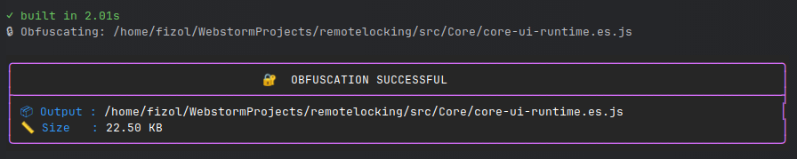

<div align="center">


# ⚙ 𝐁𝐥𝐚𝐜𝐤𝐁𝐨𝐱 𝐑𝐮𝐧𝐭𝐢𝐦𝐞

#### <p>Remote execution control for obfuscated React components</p>
<br/>


<br/>
<br/>

### 🏗️ 𝐎𝐩𝐞𝐧 𝐀𝐫𝐜𝐡𝐢𝐭𝐞𝐜𝐭𝐮𝐫𝐞 𝐃𝐨𝐜𝐬
[](Docs/DetaileGuide.md)

<br/>

> Protect your React components from theft with remote-controlled licensing and code obfuscation. Perfect for trial versions, unpaid features, or client-specific deployments.

<br/>

</div>

## 🖼️ How It Works

### Test Component: `ShimmerHeading`

<div align="left">
  
</div>

### Locked vs Unlocked

<table align="center" style="text-align: center;">
  <thead>
    <tr>
      <th style="padding: 10px;">🔓 Unlocked <br/><small>(LOCK_ENABLED=false)</small></th>
      <th style="padding: 10px;">🔒 Locked <br/><small>(LOCK_ENABLED=true)</small></th>
    </tr>
  </thead>
  <tbody>
    <tr>
      <td style="padding: 10px;">
        
      </td>
      <td style="padding: 10px;">
        
      </td>
    </tr>
  </tbody>
</table>

## 🏛️ Two-Project Architecture

BlackBox uses a **Creator/Consumer** split to keep your licensing system secure.

```
┏━━━━━━━━━━━━━━━━━━━━━━━━━━━━━━━┓        ┏━━━━━━━━━━━━━━━━━━━━━━━━━━━━━━━━━━┓
┃  🔒  PROJECT 1 (Creator)      ┃──────▶ ┃  📦  PROJECT 2 (Consumer)        ┃
┃  "MyProject"                  ┃        ┃  "MyProject_deliver"             ┃
┃  Private · Keep to yourself   ┃        ┃  Clean · Ship to clients         ┃
┗━━━━━━━━━━━━━━━━━━━━━━━━━━━━━━━┛        ┗━━━━━━━━━━━━━━━━━━━━━━━━━━━━━━━━━━┛

📂 Contains:                             📂 Contains:
• LICENSE_O_S/*                          • Core/* (obfuscated)
• vite.lock.config.ts                    • ComponentsToBeLocked.tsx
• obfuscate.js                           • Normal app files
• VercelBackend/*
• config.variables.ts                    🚫 Does NOT contain:
• Source components                      • LICENSE_O_S/*
                                         • vite.lock.config.ts
🎯 Purpose:                              • obfuscate.js
Build & update locked components         • VercelBackend/*
                                         • Any licensing code

                                         🎯 Purpose:
                                         Safe client delivery
```

**Workflow**: Edit in Project 1 → Build → Copy `Core/` to Project 2 → Ship Project 2

## ⚡ Quick Setup (15 minutes)

### 1. Install Dependencies

```bash
yarn add -D \
  javascript-obfuscator \
  rollup-plugin-javascript-obfuscator \
  vite \
  terser \
  typescript \
  ts-node \
  @vitejs/plugin-react \
  vite-plugin-dts \
  vite-plugin-svgr \
  @types/node
```

### 2. Create Required Files in Project 1

Copy these from the repository:

#### Core Configuration Files
1. `src/LICENSE_O_S/config.variables.ts` - Centralized settings
2. `vite.lock.config.ts` - Build configuration
3. `obfuscate.js` - Obfuscation script
4. `src/LICENSE_O_S/LicenseGuard/useComponent_G.ts` - Guard hook
5. `src/LICENSE_O_S/LicenseGuard/ui_G.tsx` - Guard UI wrapper

#### Your Files
6. `src/BarrelFile/ComponentsToBeLocked.tsx` - List components to lock

```typescript
// Example: ComponentsToBeLocked.tsx
import { QuickLinkButton } from "../Components/ContactUsPage/QuickLinkButton";
import { SectionHeader } from "../Components/ContactUsPage/SectionHeader";

export { QuickLinkButton, SectionHeader };
```

### 3. Configure Settings

Edit `src/LICENSE_O_S/config.variables.ts`:

```typescript
export const BUILD_CONFIG = {
    LK_COMP: 'Core',
    LK_COMP_FILENAME: 'core-ui-runtime',
    COMPONENTS_FOLDER: 'Components',
    BARREL_FILE_PATH: 'BarrelFile/ComponentsToBeLocked.tsx',
} as const;

export const GUARD_CONFIG = {
    API_ENDPOINT: 'https://your-backend.vercel.app/api/guard',
    CHECK_INTERVAL: 300000,  // 5 minutes
    PAGE_ISOLATION: false,
} as const;
```

### 4. Add Build Script

In `package.json`:
```json
{
  "scripts": {
    "build:lock": "vite build --config vite.lock.config.ts && node obfuscate.js"
  }
}
```

## 🔒 Lock Your Components

### ⚠️ CRITICAL: Security Rules

```
❌ WRONG - Exposes licensing system:
   import { G_Wrapper } from "../LICENSE_O_S/LicenseGuard/ui_G.tsx";
   export { G_Wrapper };  // Never re-export!

✅ CORRECT - Import directly inside each component:
   import { G_Wrapper } from "../LICENSE_O_S/LicenseGuard/ui_G.tsx";
   // Use immediately, don't re-export
```

### Wrap Each Component

In each component file (e.g., `QuickLinkButton.tsx`):

```typescript
// ✅ Import directly in component file
import { G_Wrapper } from "../LICENSE_O_S/LicenseGuard/ui_G.tsx";
import { useComponentGuard } from "../LICENSE_O_S/LicenseGuard/useComponent_G.ts";

export const QuickLinkButton: React.FC = () => {
  const GS = useComponentGuard();

  return (
    <G_Wrapper State_G={GS}>
      <button>Click me</button>
    </G_Wrapper>
  );
};
```

### Build Locked Version

```bash
npm run build:lock
```



Output: `src/Core/core-ui-runtime.es.js` (obfuscated)

## 📦 Prepare Project 2 (Delivery)

**Do this ONCE after Project 1 is working:**

### Step 1: Duplicate Project

```bash
cd ..
cp -r MyProject MyProject_deliver
cd MyProject_deliver
```

### Step 2: Clean Sensitive Files

```bash
# Remove licensing system
rm -rf src/LICENSE_O_S
rm -f vite.lock.config.ts
rm -f obfuscate.js
rm -rf VercelBackend
```

### Step 3: Update Imports

In `src/BarrelFile/ComponentsToBeLocked.tsx`:

```typescript
// ❌ Remove original imports
// import { QuickLinkButton } from "./Components/ContactUsPage/QuickLinkButton";

// ✅ Replace with locked version
import { QuickLinkButton } from "./Core/core-ui-runtime.es";

export { QuickLinkButton };
```

### Step 4: Delete Source Files

```bash
rm -rf src/Components/ContactUsPage/QuickLinkButton.tsx
rm -rf src/Components/ContactUsPage/SectionHeader.tsx
```

### Step 5: Verify

**Project 2 should contain:**
- ✅ `src/Core/core-ui-runtime.es.js`
- ✅ `src/BarrelFile/ComponentsToBeLocked.tsx`
- ✅ Normal app files

**Should NOT contain:**
- ❌ LICENSE_O_S/
- ❌ vite.lock.config.ts
- ❌ obfuscate.js
- ❌ VercelBackend/
- ❌ Original source components

## 🔄 Update Workflow

When modifying locked components:

```
1. Edit in Project 1
   → Modify src/Components/YourComponent.tsx

2. Rebuild
   → npm run build:lock

3. Copy to Project 2
   → cp src/Core/core-ui-runtime.es.js ../MyProject_deliver/src/Core/

4. Test Project 2
   → cd ../MyProject_deliver && npm run dev

5. Ship Project 2 to client
```

## 🌐 Deploy Backend

### 1. Setup Vercel Project

Use the provided `VercelBackend/` folder with:
- `api/guard.js`
- `package.json`
- `vercel.json`

### 2. Deploy

```bash
cd VercelBackend
vercel deploy --prod
```

### 3. Set Environment Variables

In Vercel Dashboard → Settings → Environment Variables:

| Variable | Example | Purpose |
|----------|---------|---------|
| `LOCK_ENABLED` | `false` | `true` = blocked, `false` = allowed |
| `SECRET_KEY` | `random-secret-123` | Secure hashing |
| `LOCK_TITLE` | `Maintenance Mode` | Lock screen title |
| `LOCK_MESSAGE` | `Feature unavailable` | Lock screen message |
| `LOCK_CONTACT` | `support@example.com` | Support contact |

### 4. Update Config

In Project 1's `src/LICENSE_O_S/config.variables.ts`:
```typescript
export const GUARD_CONFIG = {
    API_ENDPOINT: 'https://your-actual-backend.vercel.app/api/guard',
    // ...
} as const;
```

## 🎛️ Control Access

Enable lock (block components):
```bash
# In Vercel Dashboard, set:
LOCK_ENABLED = true
```

Disable lock (allow access):
```bash
LOCK_ENABLED = false
```

Changes take effect within 5 minutes (default `CHECK_INTERVAL`).

## ✅ Testing

### Test Project 1 (Creator)
```bash
cd MyProject
npm run build:lock
npm run dev
```

Verify lock behavior works with `LOCK_ENABLED=true`.

### Test Project 2 (Delivery)
```bash
cd MyProject_deliver
npm run dev
```

Verify:
- ✅ Components work
- ✅ No licensing file errors
- ✅ Lock/unlock responds correctly
- ✅ Code in `Core/core-ui-runtime.es.js` is obfuscated

### Test Backend
```bash
curl -X POST https://your-backend.vercel.app/api/guard \
  -H "Content-Type: application/json" \
  -d '{"t":1234567890123,"s":"abc123","r":"test-1"}'
```

Expected:
```json
{
  "locked": false,
  "title": "Access Restricted",
  "message": "Feature unavailable",
  "contact": "support@example.com",
  "timestamp": 1234567890123
}
```

## 🚨 Troubleshooting

| Issue | Solution |
|-------|----------|
| Cannot find config.variables | Check path: `src/LICENSE_O_S/config.variables.ts` |
| Always blocked | Set `LOCK_ENABLED=false` in Vercel |
| Build fails | Verify `BUILD_CONFIG` matches folder structure |
| CORS errors | Check `Access-Control-Allow-Origin` in `guard.js` |
| Licensing files in Project 2 | Re-run cleanup steps |

## 📋 Quick Reference

### Project 1 Files
- Config: `src/LICENSE_O_S/config.variables.ts`
- Build: `vite.lock.config.ts`
- Obfuscation: `obfuscate.js`
- Guard: `src/LICENSE_O_S/LicenseGuard/`
- Output: `src/Core/core-ui-runtime.es.js`

### Project 2 Files
- Bundle: `src/Core/core-ui-runtime.es.js`
- Exports: `src/BarrelFile/ComponentsToBeLocked.tsx`

### Key Commands
- Build: `npm run build:lock` (Project 1)
- Copy: `cp src/Core/core-ui-runtime.es.js ../MyProject_deliver/src/Core/`
- Deploy: `vercel deploy --prod` (VercelBackend)

## 🎯 First-Time Checklist

**Project 1 Setup:**
- [ ] Install dependencies
- [ ] Create `config.variables.ts` with your settings
- [ ] Copy all 5 core files
- [ ] Wrap components with `G_Wrapper` and `useComponentGuard`
- [ ] Create barrel file
- [ ] Run `npm run build:lock` successfully
- [ ] Deploy VercelBackend
- [ ] Update `API_ENDPOINT` in config
- [ ] Test lock/unlock

**Project 2 Setup:**
- [ ] Copy Project 1 → Project 2
- [ ] Remove LICENSE_O_S, vite.lock.config.ts, obfuscate.js, VercelBackend
- [ ] Update `ComponentsToBeLocked.tsx` imports
- [ ] Delete original source components
- [ ] Test thoroughly
- [ ] Ship ONLY Project 2 to client

---

**Need more details?** See [Detailed Guide](Docs/DetaileGuide.md) for advanced configurations.