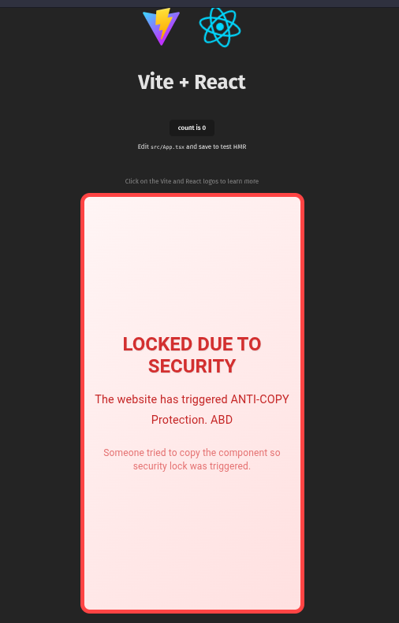
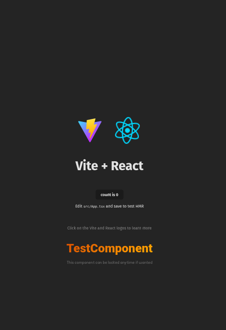

<div align="center">


# ⚙ 𝐁𝐥𝐚𝐜𝐤𝐁𝐨𝐱 𝐑𝐮𝐧𝐭𝐢𝐦𝐞 

#### <p>Remote execution control for obfuscated React components</p>
<br/>


<br/>
<br/>
</div>


<div align="center">

### 🏗️ 𝐎𝐩𝐞𝐧 𝐀𝐫𝐜𝐡𝐢𝐭𝐞𝐜𝐭𝐮𝐫𝐞 𝐃𝐨𝐜𝐬
[](Docs/DetaileGuide.md)


> Protect your React components from theft with remote-controlled licensing and code obfuscation. Perfect for trial versions, unpaid features, or client-specific deployments.
</div>
---

## ⚡ Quick Setup (15 minutes)

### Step 1: Install Dependencies

```bash
yarn add -D \
  javascript-obfuscator \
  rollup-plugin-javascript-obfuscator \
  vite \
  terser \
  typescript \
  ts-node \
  @vitejs/plugin-react \
  vite-plugin-dts \
  vite-plugin-svgr
```

### Step 2: Add Core Files

Create these 5 files in your project:

1. **`vite.lock.config.ts`** (root) - Build configuration
2. **`obfuscate.js`** (root) - Obfuscation settings
3. **`src/LICENSE_O_S/useComponentGuard.ts`** - License checking hook
4. **`src/LICENSE_O_S/Ui_G.tsx`** - UI wrapper components
5. **`src/BarrelFile/ComponentsToBeLocked.tsx`** - Barrel file for locked components

> 📁 Copy the full code from the provided files

### Step 3: Configure Variables

**In `vite.lock.config.ts`** - Set your project paths:
```typescript
const componentsRoot = path.resolve(srcRoot, 'Components');  // Components to lock
const entryFile = path.resolve(srcRoot, 'src/BarrelFile/ComponentsToBeLocked.tsx');  // Barrel file
const LK_Comp = 'Core';  // Output folder name
const LK_CompFileName = 'core-ui-runtime';  // Output file name
```

**In `obfuscate.js`** - Match the output names:
```javascript
const LK_Comp = 'Core';
const LK_CompFileName = 'core-ui-runtime';
```

**In `useComponentGuard.ts`** - Set your API endpoint:
```typescript
private apiEndpoint: string = 'https://your-backend.vercel.app/api/guard';
private checkInterval: number = 300000; // 5 minutes (in milliseconds)
```

### Step 4: Add Build Script

**In `package.json`**:
```json
"scripts": {
  "build:lock": "vite build --config vite.lock.config.ts && node obfuscate.js"
}
```

---

## 🔒 Locking Your Components

### 1. Create Barrel File

**`src/BarrelFile/ComponentsToBeLocked.tsx`**:
```typescript
// List all components you want to lock
import { QuickLinkButton } from "../Components/ContactUsPage/QuickLinkButton";
import { SectionHeader } from "../Components/ContactUsPage/SectionHeader";
import { StatisticCard } from "../Components/ContactUsPage/StatisticCard";

export { QuickLinkButton, SectionHeader, StatisticCard };
```

### 2. Wrap Each Component

**In each component file** (e.g., `QuickLinkButton.tsx`):
```typescript
// Add imports at top
import { G_Wrapper } from "../LICENSE_O_S/Ui_G";
import { useComponentGuard } from "../LICENSE_O_S/useComponentGuard";

export const QuickLinkButton: React.FC = () => {
  // Add guard hook
  const GS = useComponentGuard();

  return (
    // Wrap entire component JSX
    <G_Wrapper State_G={GS}>
      {/* Your existing component code */}
    </G_Wrapper>
  );
};
```

### 3. Build Locked Version

```bash
npm run build:lock
```

This creates: `src/Core/core-ui-runtime.es.js` (obfuscated + locked)

### 4. Replace Source Code

**Update `ComponentsExports.tsx`**:
```typescript
// Remove original imports
// import { QuickLinkButton } from "../Components/ContactUsPage/QuickLinkButton";

// Replace with locked version
import { QuickLinkButton, SectionHeader, StatisticCard } from "../Core/core-ui-runtime.es";

export { QuickLinkButton, SectionHeader, StatisticCard };
```

**Delete original source files** (optional but recommended):
```bash
rm src/Components/ContactUsPage/QuickLinkButton.tsx
rm src/Components/ContactUsPage/SectionHeader.tsx
rm src/Components/ContactUsPage/StatisticCard.tsx
```

---

## 🌐 Deploy Backend (Vercel)

### 1. Create Vercel Project

```
LicenseBackend/
├── api/
│   └── guard.js
├── package.json
└── vercel.json
```

### 2. Deploy

```bash
cd LicenseBackend
vercel deploy --prod
```

### 3. Configure Environment Variables

In Vercel Dashboard → Settings → Environment Variables:

| Variable | Value | Purpose |
|----------|-------|---------|
| `LOCK_ENABLED` | `false` | Set to `true` to block access |
| `SECRET_KEY` | `your-random-secret-123` | For secure hashing |
| `LOCK_TITLE` | `Maintenance Mode` | Shown when locked |
| `LOCK_MESSAGE` | `Feature unavailable` | Detailed message |
| `LOCK_CONTACT` | `Contact: support@...` | Support info |

---

## 🎛️ Control Access

### Enable Lock (Block Components)
```bash
vercel env add LOCK_ENABLED
# Enter: true
vercel deploy --prod
```

### Disable Lock (Allow Access)
```bash
vercel env add LOCK_ENABLED
# Enter: false
vercel deploy --prod
```

Changes take effect within 5 minutes (default check interval).

---

## ✅ Testing

### 1. Test Lock State

**Frontend** (Components show restriction message):
```typescript
// In browser console
// Components should show: "Access Restricted" UI
```

**Backend** (Check API response):
```bash
curl -X POST https://your-backend.vercel.app/api/guard \
  -H "Content-Type: application/json" \
  -d '{"t":1234567890123,"s":"abc123","r":"test-req-1"}'
```

### 2. Verify Obfuscation

Open `src/Core/core-ui-runtime.es.js` - should be unreadable:
```javascript
/* eslint-disable */
var _0x4a2c=['prototype','constructor','...'];
// Completely obfuscated code
```

---

## 🔧 Common Adjustments

### Change Check Interval

**In `useComponentGuard.ts`**:
```typescript
private checkInterval: number = 60000; // 1 minute
// or
private checkInterval: number = 600000; // 10 minutes
```

### Add Page-Specific Locking

```typescript
// In component
const GS = useComponentGuard({
  pageIsolation: true,
  pageId: 'pricing-page'
});
```

### Custom Lock UI

```typescript
<G_Wrapper 
  State_G={GS}
  rst_Component={<YourCustomBlockedUI />}
>
  {/* Component */}
</G_Wrapper>
```

---

## 🚨 Troubleshooting

| Issue | Solution |
|-------|----------|
| "Cannot find module 'vite'" | Run dependency install command |
| Components always blocked | Check `LOCK_ENABLED` is `false` |
| Obfuscation fails | Reduce `controlFlowFlatteningThreshold` in `obfuscate.js` |
| API CORS errors | Verify `Access-Control-Allow-Origin` in `guard.js` |
| Build errors | Ensure barrel file path matches `vite.lock.config.ts` |

---

## 📋 Quick Reference

### File Locations
- **Build config**: `vite.lock.config.ts` (root)
- **Obfuscation**: `obfuscate.js` (root)
- **Guard hook**: `src/LICENSE_O_S/useComponentGuard.ts`
- **Guard UI**: `src/LICENSE_O_S/Ui_G.tsx`
- **Barrel file**: `src/BarrelFile/ComponentsToBeLocked.tsx`
- **Output**: `src/Core/core-ui-runtime.es.js`

### Key Commands
- **Build locked version**: `npm run build:lock`
- **Deploy backend**: `vercel deploy --prod`
- **Enable lock**: Set `LOCK_ENABLED=true` in Vercel
- **Disable lock**: Set `LOCK_ENABLED=false` in Vercel

---

## 🎯 Next Steps

1. Read `DetailedReadme.md` to understand the architecture
2. Customize obfuscation settings in `obfuscate.js`
3. Set up production environment variables
4. Test lock/unlock cycles thoroughly
5. Integrate with your deployment pipeline

**Need help?** Check the detailed documentation for architecture explanations and advanced configurations.


## Demonstration

### Test Component: `ShimmerHeading`

<div align="center">
  
</div>

---

### Locked vs Unlocked Comparison

| Locked Component                                                                    | Unlocked Component                                                                    |
|-------------------------------------------------------------------------------------|---------------------------------------------------------------------------------------|
|  |  |

This shows a **side-by-side comparison** of how the `ShimmerHeading` component is displayed when **locked** versus **unlocked**.

- **Left:** The component served from the **BlackBox UI (locked)** bundle.
- **Right:** The component served normally from the source code.  
